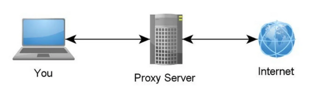
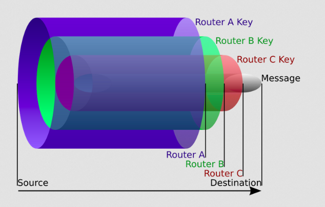
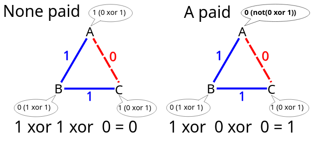
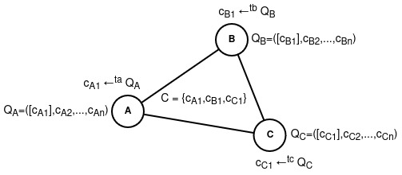
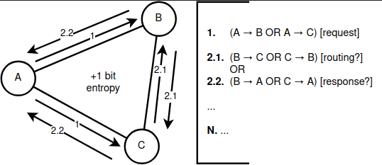

<p align="center">
    
</p>

<h2>
	<p align="center">
    	<strong>
        	Awesome Anonymity
   		</strong>
	</p>
	<p align="center">
		<a href="https://github.com/number571/awesome-anonymity/blob/master/LICENSE">
        	
		</a>
        <a href="https://github.com/number571/awesome-anonymity/pulse">
        	
		</a>
        <a href="https://github.com/number571/awesome-anonymity/commits/master">
        	
		</a>
	</p>
	About repository
</h2>

> Habr: https://habr.com/ru/articles/912554/

Each anonymous network can be attributed to a specific problem (or to a hybrid of certain problems). Currently, there are five anonymization problems: Onion, Proxy, DC, QB, EI. If the network does not belong to one of these problems, it means that either the network is not anonymous, or a new anonymization problem has been opened. In the latter case, it is necessary to prove that the new anonymization problem actually implements an algorithm for obfuscating/hiding routing.

## What is anonymity?

Anonymity is the concealment of the true connections between multiple senders and recipients from multiple observers. At the same time, many observers can be located in both a set of senders and a set of recipients, which makes the task of anonymization more time-consuming and selective.

### Examples of non-anonymous networks

* All centralized services: Telegram, Facebook, Github, ...
* Decentralised networks (without any anonymizing problem): Bitmessage ...
* Pure VPN, Proxy services without additional obfuscating/hiding routing algorithm
* Highly specialized systems with the property of confidential: Monero, Dash, ...
* Applications based on an anonymous network: HLM (messenger), HLF (filesharer), ...

<details>
  <summary>Why is Monero not an anonymous network?</summary>
  <br>
  <p>
If we assume that RingSignature is an anonymization problem, then it should ensure anonymity in the network communication of subscribers. Let's further assume that there are three subscribers: {A, B, C}, who know each other's public keys and are connected to each other. In this case, A signs the message m with the public keys {B, C} and his private key, thereby forming a ring signature s. Next, subscriber A sends {m, s} to participant B. No one except {A, C}, without knowledge of their private keys, would be able to send this message, which is related to the authentication indicator, but not anonymity, because if the ring signature s did not exist at all, then the situation on the part of anonymity would not have changed at all. If we used additional proxying or tunneling, it would become a completely different problem, i.e. Proxy or Onion. Thus, the use of ring signatures is more similar to the use of a common MAC value by three participants on the part of symmetric cryptography. Only in the first case, instead of symmetric cryptography, we use asymmetric cryptography, without risking compromising the only secret.
  </p>
</details>

<details>
  <summary>Why is Dash not an anonymous network?</summary>
  <br>
  <p>
Unlike Monero, cryptocurrency Dash does have an anonymization problem similar to Mix networks, where one node accepts X denominations of the same length from the sender, which are then mixed and sent to the final recipient. Nevertheless, this Mix problem is only a special case of the Onion/Mix problem, because it does not encrypt data and, as a result, allows mixing data exclusively in currency format.
  </p>
</details>

## Tags

1. network_arch = [p2p, hybrid]
2. network_type = [open, closed]
3. network_routing = [classic, wandering, broadcast]
4. source_code = [open, closed, missing]
5. scalability = [O(1), O(N)]
6. subtype_problem = [mixnet, garlic, f2f, noise-gen]

## Problems

### 1. Proxy

<p align="center">
    
</p>

$$
Proxy_{\{K\}}(m)= E(k_n, m) \rightarrow E(k_{n-1}, m) \rightarrow\dotsc\rightarrow E(k_1, m) \rightarrow m,
$$

$$
where \\ E\text{ - encryption}, \\ m\text{ - message}, \\ \{k_i\} \in K \text{ - keys}
$$

#### Research papers
* [Crowds: Anonymity for Web Transactions](https://web.archive.org/web/20051212103028/http://avirubin.com/crowds.pdf)
* [GAP – practical anonymous networking](https://www.researchgate.net/publication/221655657_GAP_-_Practical_Anonymous_Networking)
* [A Distributed Decentralised Information Storage and Retrieval System](https://www.hyphanet.org/assets/papers/ddisrs.pdf)

#### Networks
* [Crowds](https://en.wikipedia.org/wiki/Crowds_(anonymity_network)): network_arch=hybrid, network_type=open, network_routing=wandering, source_code=missing, scalability=O(1)
* [GNUnet](https://www.gnunet.org/en/): network_arch=p2p, network_type=open, network_routing=classic, source_code=open, scalability=O(1)
* [Hyphanet (Freenet)](https://www.hyphanet.org/index.html): network_arch=p2p, network_type=closed, network_routing=wandering, source_code=open, scalability=O(1), subtype_problem=f2f
* [RetroShare](https://retroshare.cc/): network_arch=p2p, network_type=closed, network_routing=classic, source_code=open, scalability=O(1), subtype_problem=f2f
* [MUTE](https://mute-net.sourceforge.net/): network_arch=p2p, network_type=closed, network_routing=wandering, source_code=open, scalability=O(1)

### 2. Onion

<p align="center">
    
</p>

$$
Onion_{\{K\}}(m)=E(k_n, E(k_{n-1}, E(\dotsc, E(k_1, m)))) \rightarrow \\ E(k_{n-1}, E(\dotsc, E(k_1, m))) \rightarrow \dotsc\\ E(k_1, m) \rightarrow m,
$$

$$
where \\ E\text{ - encryption}, \\ m\text{ - message}, \\ \{k_i\} \in K \text{ - keys}
$$

#### Research papers
* [Untraceable Electronic Mail, Return Addresses, and Digital Pseudonyms](https://dl.acm.org/doi/10.1145/358549.358563)
* [Securing the Tor Network](https://www.blackhat.com/presentations/bh-usa-07/Perry/Whitepaper/bh-usa-07-perry-WP.pdf)
* [I2P - Invisible Internet Project](https://staas.home.xs4all.nl/t/swtr/documents/wt2015_i2p.pdf)
* [Mixminion: Design of a Type III Anonymous Remailer Protocol](https://www.mixminion.net/minion-design.pdf)

#### Networks
* [Tor](https://www.torproject.org/en/): network_arch=hybrid, network_type=open&closed, network_routing=classic, source_code=open, scalability=O(1)
* [I2P](https://geti2p.com/): network_arch=p2p, network_type=closed, network_routing=classic, source_code=open, scalability=O(1), subtype_problem=garlic
* [Mixminion](https://www.mixminion.net/): network_arch=hybrid, network_type=open, network_routing=classic, source_code=open, scalability=O(1), subtype_problem=mixnet
* [Perfect Dark](http://www21.atwiki.jp/botubotubotubotu/): network_arch=hybrid, network_type=closed, network_routing=classic, source_code=closed, scalability=O(1), subtype_problem=mixnet

### 3. DC (dining cryptographers problem)

<p align="center">
    
</p>

$$
DC_{\{G\}}(m)=\bigoplus_{i=1}^{n} (m_i\text{ }xor\text{ }\bigoplus_{j=1}^{n} G(i)_j),
$$

$$
where \\ i \neq j, \\ n\text{ - count of nodes}, \\ m\text{ - message}, \\ G(i)_j \text{ - generated bit between } i,j \text{ nodes}
$$

#### Research papers
* [The Dining Cryptographers Problem: Unconditional Sender and Recipient Untraceability](https://www.cs.cornell.edu/people/egs/herbivore/dcnets.html)
* [Herbivore: A Scalable and Efficient Protocol for Anonymous Communication](https://www.cs.cornell.edu/people/egs/herbivore/herbivore.pdf)
* [Dissent in Numbers: Making Strong Anonymity Scale](https://dedis.cs.yale.edu/dissent/papers/osdi12.pdf)
* [PriFi: Low-Latency Anonymity for Organizational Networks](https://petsymposium.org/2020/files/papers/issue4/popets-2020-0059.pdf)

#### Networks
* [Herbivore](https://www.cs.cornell.edu/people/egs/herbivore/faq.html): network_arch=p2p, network_type=open, network_routing=broadcast, source_code=missing, scalability=O(1)-O(N)
* [Dissent](https://github.com/dedis/Dissent): network_arch=hybrid, network_type=open, network_routing=broadcast, source_code=open, scalability=O(N)
* [PriFi](https://github.com/dedis/prifi): network_arch=hybrid, network_type=open, network_routing=broadcast, source_code=open, scalability=O(N)

### 4. QB (queue based problem)

<p align="center">
    
</p>

```math
QB_{\{K\}}(m)=Q(t)\leftarrow
\begin{cases}E(k,m)\leftarrow Input\\E(r, v)\leftarrow Random,\text{ }if\text{ }Q=\varnothing\text{ }
\end{cases},
```

$$
where \\ Q \text{ - queue of ciphertexts},\\ t \text{ - interval of generation},\\ E \text{ - encryption},\\ k, r \in K \text{ - keys},\\ m \text{ - message},\\ v \text{ - void message (noise)}
$$

#### Research papers
* [Анонимная сеть «Hidden Lake»](https://github.com/number571/hidden-lake/blob/master/docs/hidden_lake_anonymous_network.pdf)

#### Networks
* [Hidden Lake](https://github.com/number571/hidden-lake): network_arch=p2p, network_type=closed, network_routing=broadcast, source_code=open, scalability=O(N), subtype_problem=f2f
* [M-A](https://github.com/number571/micro-anon): network_arch=p2p, network_type=closed, network_routing=classic, source_code=open, scalability=O(1)-O(N)

### 5. EI (entropy increase problem)

<p align="center">
    
</p>

```math
EI_{\{K\}}(m)=
\begin{cases}E(k_1, m),\text{ }if\text{ }R\text{ }mod\text{ }2=0\\ E(k_2,E(k_1, m)),\text{ }else
\end{cases}, 
```

$$
where \\ E\text{ - encryption}, \\ m\text{ - message}, \\ \{k_i\} \in K \text{ - keys}
$$

#### Research papers
* [Анонимная сеть с теоретически доказуемой моделью на базе увеличения энтропии](https://habr.com/ru/articles/743630/)

#### Networks
* _

## Hybrids

Anonymous networks can be built on the basis of several anonymization problems. These networks will be referred to as hybrid networks based on the method of traffic concealment. Some anonymous networks described in this way cannot be correctly attributed to only one problem of anonymization.

### 1. Proxy + Onion

#### Documentations
* RetroShare: [+Tor](https://retrosharedocs.readthedocs.io/en/latest/tutorial/tor-hidden-rs-node/), [+I2P](https://retrosharedocs.readthedocs.io/en/latest/tutorial/i2p-hidden-rs-node/)

### 2. Onion + QB

#### Research papers
* [Vuvuzela: Scalable Private Messaging Resistant to Traffic Analysis](https://pdos.csail.mit.edu/papers/vuvuzela:sosp15.pdf)

#### Networks
* [Vuvuzela](https://github.com/vuvuzela/vuvuzela): network_arch=hybrid, network_type=closed, network_routing=classic, source_code=open, scalability=O(1)-O(N), subtype_problem=mixnet&noise-gen

## License

Licensed under the MIT License. See [LICENSE](LICENSE) for the full license text.
