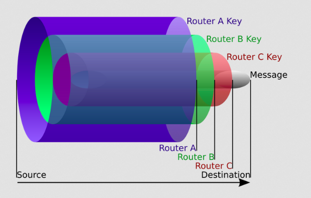

<p align="center">
    
</p>

<h2>
	<p align="center">
    	<strong>
        	Awesome Anonymity
   		</strong>
	</p>
	<p align="center">
		<a href="https://github.com/number571/awesome-anonymity/blob/master/LICENSE">
        	
		</a>
        <a href="https://github.com/number571/awesome-anonymity/pulse">
        	
		</a>
        <a href="https://github.com/number571/awesome-anonymity/commits/master">
        	
		</a>
	</p>
	About repository
</h2>

Each anonymous network can be attributed to a specific problem (or to a hybrid of certain problems). Currently, there are five anonymization problems: Onion, Proxy, DC, QB, EI. If the network does not belong to one of these problems, it means that either the network is not anonymous, or a new anonymization problem has been opened. In the latter case, it is necessary to prove that the new anonymization problem actually implements an algorithm for obfuscating/hiding routing.

## What is anonymity?

Anonymity is the concealment of the true connections between multiple senders and recipients from multiple observers. At the same time, many observers can be located in both a set of senders and a set of recipients, which makes the task of anonymization more time-consuming and selective.

### Examples of non-anonymous networks

* All centralized services: Telegram, Facebook, Github, ...
* Client-secure only applications: Bitmessage, RetroShare, Freenet ...
* Decentralized networks without an obfuscating/hiding routing algorithm: MUTE, ...
* Pure VPN, Proxy services without additional obfuscating/hiding routing algorithm

## Tags

1. network_arch = [p2p, hybrid]
2. network_type = [open, closed]
3. source_code = [open, closed, missing]
4. subtype_problem = [mixnet, garlic, f2f]
5. todo_tag (need add/set tags)

## Problems

### 1. Onion

<p align="center">
    
</p>

### Pattern

```
E(K3, E(K2, E(K1, M))) -> E(K2, E(K1, M)) -> E(K1, M) -> M
where
	E - encryption
	K - key
	M - message
```

#### Research papers
* [Untraceable Electronic Mail, Return Addresses, and Digital Pseudonyms](https://dl.acm.org/doi/10.1145/358549.358563)
* [Securing the Tor Network](https://www.blackhat.com/presentations/bh-usa-07/Perry/Whitepaper/bh-usa-07-perry-WP.pdf)
* [I2P - Invisible Internet Project](https://staas.home.xs4all.nl/t/swtr/documents/wt2015_i2p.pdf)
* [Mixminion: Design of a Type III Anonymous Remailer Protocol](https://www.mixminion.net/minion-design.pdf)

#### Networks
* [Tor](https://www.torproject.org/ru/): network_arch=hybrid, network_type=open|closed, source_code=open
* [I2P](https://geti2p.com/): network_type=p2p, network_type=closed, source_code=open, subtype_problem=garlic
* [Mixminion](https://www.mixminion.net/): network_arch=hybrid, network_type=open, source_code=open, subtype_problem=mixnet
* [Perfect Dark](http://www21.atwiki.jp/botubotubotubotu/): network_type=hybrid, network_type=closed, source_code=closed, subtype_problem=mixnet

### 2. Proxy

<p align="center">
    
</p>

### Pattern

```
E(K3, M) -> E(K2, M) -> E(K1, M) -> M
where
	E - encryption
	K - key
	M - message
```

#### Research papers
* [Crowds: Anonymity for Web Transactions](https://web.archive.org/web/20051212103028/http://avirubin.com/crowds.pdf)

#### Networks
* [Crowds](https://en.wikipedia.org/wiki/Crowds_(anonymity_network)): network_arch=hybrid, network_type=open, source_code=missing

### 3. DC (dining cryptographers problem)

<p align="center">
    
</p>

### Pattern

```
(A(B) xor A(C)) xor (B(A) xor B(C)) xor (C(A) xor C(B))    -> M = 0b
(A(B) xor A(C)) xor (B(A) xor B(C)) xor not(C(A) xor C(B)) -> M = 1b
where
	A(B) = B(A) - total generated bit between A and B
	B(C) = C(B) - total generated bit between B and C
	C(A) = A(C) - total generated bit between C and A
```

#### Research papers
* [The Dining Cryptographers Problem: Unconditional Sender and Recipient Untraceability](https://www.cs.cornell.edu/people/egs/herbivore/dcnets.html)
* [Herbivore: A Scalable and Efficient Protocol for Anonymous Communication](https://www.cs.cornell.edu/people/egs/herbivore/herbivore.pdf)
* [Dissent in Numbers: Making Strong Anonymity Scale](https://dedis.cs.yale.edu/dissent/papers/osdi12.pdf)
* [PriFi: Low-Latency Anonymity for Organizational Networks](https://petsymposium.org/2020/files/papers/issue4/popets-2020-0059.pdf)

#### Networks
* [Herbivore](https://www.cs.cornell.edu/people/egs/herbivore/faq.html): network_arch=p2p, network_type=open, source_code=missing
* [Dissent](https://github.com/dedis/Dissent): network_arch=hybrid, network_type=open, source_code=open
* [PriFi](https://github.com/dedis/prifi): network_arch=hybrid, network_type=open, source_code=open

### 4. QB (queue based problem)

<p align="center">
    
</p>

### Pattern

```
(E(K, M) OR E(R, V)) <- A(x)
where
	E - encryption
	K - key
	R - random key
	M - message
	V - void message
	A - generation algorithm
	x - independent event
```

#### Research papers
* [Анонимная сеть «Hidden Lake»](https://github.com/number571/go-peer/blob/master/docs/hidden_lake_anonymous_network.pdf)

#### Networks
* [Hidden Lake](https://github.com/number571/go-peer/tree/master/cmd/hidden_lake): network_arch=p2p, network_type=closed, source_code=open, subtype_problem=f2f
* [M-A](https://github.com/number571/go-peer/tree/master/cmd/micro_anon): network_arch=p2p, network_type=closed, source_code=open, subtype_problem=f2f

### 5. EI (entropy increase problem)

<p align="center">
    
</p>

### Pattern

```
E(K1, M) OR E(K2, E(K1, M))
where
	E - encryption
	K - key
	M - message
```

#### Research papers
* [Анонимная сеть с теоретически доказуемой моделью на базе увеличения энтропии](https://habr.com/ru/articles/743630/)

#### Networks
* _
